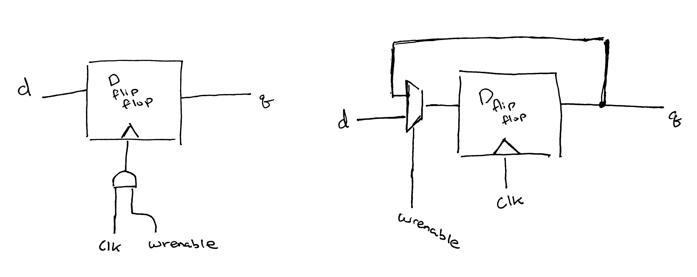

# Report

### 1.

### 6.

The input comes in as a number, which we can use to bit shift the `enable` line towards the channel that it should power. If enable is set to `1`, that means that the output line of our chosen channel is on, and other outputs are `0`.

So, for instance, let's say our `address = 5'b00101` or `5'd5`. The out has 32 pins. If we take `enable = 1'b1` and left bit shift it 5 times, the 5th line in out would be set to enable. This effectively decodes a binary representation of which output we want to the actual output wire we want to
set.
