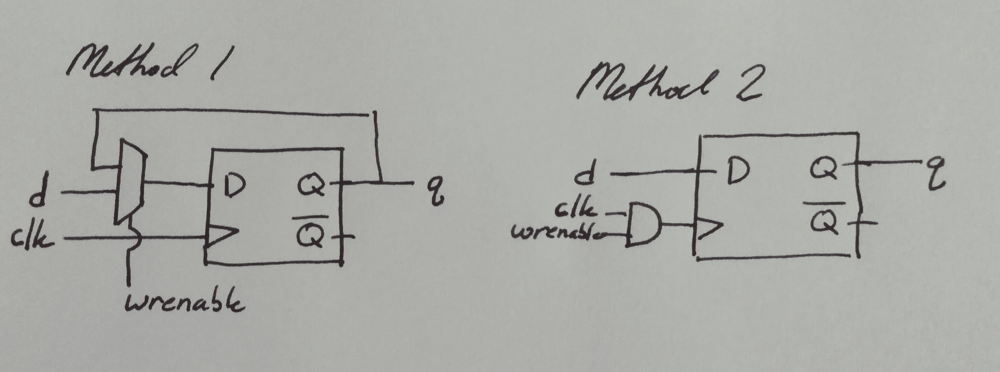

# HW4
## Deliverable 1

## Deliverable 6

Decoders typically take an n-digit binary number and decode that number into 2^n outputs.

The included decoder module takes advantage of behavioral Verilog's bit shift operator, '<<'. As written in the module, enable is assigned to the 0th bit of the "out" wire and then shifted to the left by the value of the address wire. For example, if I wanted to write a '1' to out[5], the code would first write a '1' to out[0], and if address = 5'd5, then the '1' in out[0] would be shifted left 5 bits into out[5]. All other bits would remain 0.