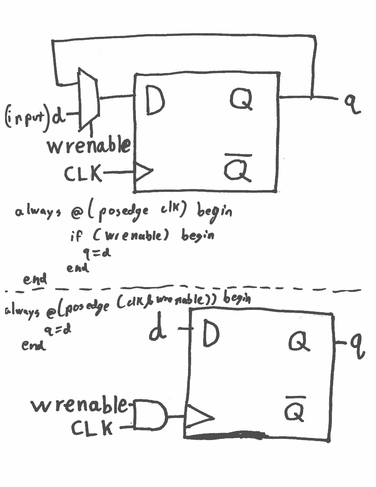

# Deliverable 1


# Deliverable 6
Enable is a zero or one depending if we want to write. If it's a zero, nothing is writen, so consider when it's one.
The '<<' operator is a left shift. In this module, we left shift enable(1) by the amount 'address'.
For example: 
```Verilog
1 << 0010 
//Equivalent to
0000 0100
```
(The input is shifted 2 bits to the left)
Now our value for out is a 32 bit number with a 1 at the value address. This let's us choose a register to write to.
